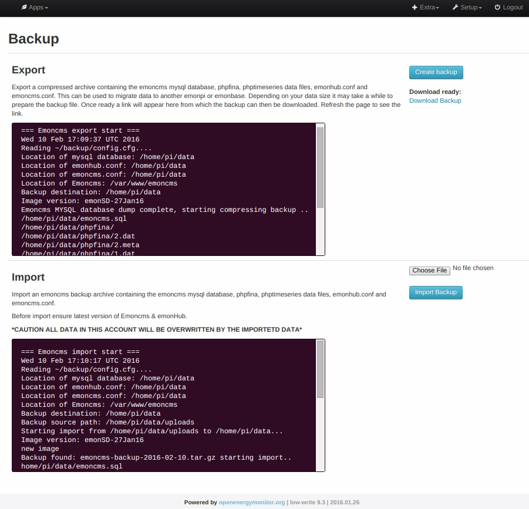

# Emoncms backup export and import tool for backup and migration

* Export a compressed archive containing the Emoncms MYSQL database, phpfina, phptimeseries data files, emonhub.conf and emoncms.conf
*
* Import compressed archive into new emonPi **(currently import via Emoncms backup web interface only work on emonPi)**

# Install
 
 Install this module in your home folder then symlink the sub-folder called backup to your emoncms Modules directory:

    cd ~/
    git clone https://github.com/emoncms/backup.git
    ln -s /home/pi/backup/backup/backup /var/www/emoncms/Modules/backup

Note: Ensure you are running the latest version of Emoncms on the Stable branch. A change was merged on the 9th Feb 16 that enables symlinked modules which is essential for backup module to appear in Emoncms https://github.com/emoncms/emoncms/commit/e83ad78e6155275d7537104367b8d44ef63d78fe

After updating a reboot or restart of apache will be required to enable symlinked modules:

    sudo service apache2 restart

## service-runner

The backup utility first requires service-runner to be running in the background on the emonpi/emonbase or other server that emoncms is running on. service-runner provides a way of starting background scripts from the emoncms UI so that when the 'create backup' button is clicked in the browser this first creates a flag in /tmp of the form /tmp/emoncms-flag-name. This flag file contains the location of the script to run and a log file. service-runner checks for flags every 1 seconds.

To install service-runner add the following entry to crontab (crontab -e):

    * * * * * ~/backup/service-runner >> /var/log/service-runner.log 2>&1

## PHP Config

In order to enable uploads of backup zip files we need to set the maximum upload size to be larger than the file we want to upload. This can be set system wide in `/etc/php5/apache2/php.ini`:

    sudo nano /etc/php5/apache2/php.ini

Use `[CTRL + W]` to search test

Set:

    post_max_size = 200M
    upload_max_filesize = 200M

# Create uploads folder

## For emonPi / emonBase:

    sudo mkdir /home/pi/data/uploads
    sudo chown www-data /home/pi/data/uploads -R
    
## Config

Set paths in `config.cfg` to match your system. An example config is included for emonPi and non-emonPi setups. The default config.cgi is for emonPi
