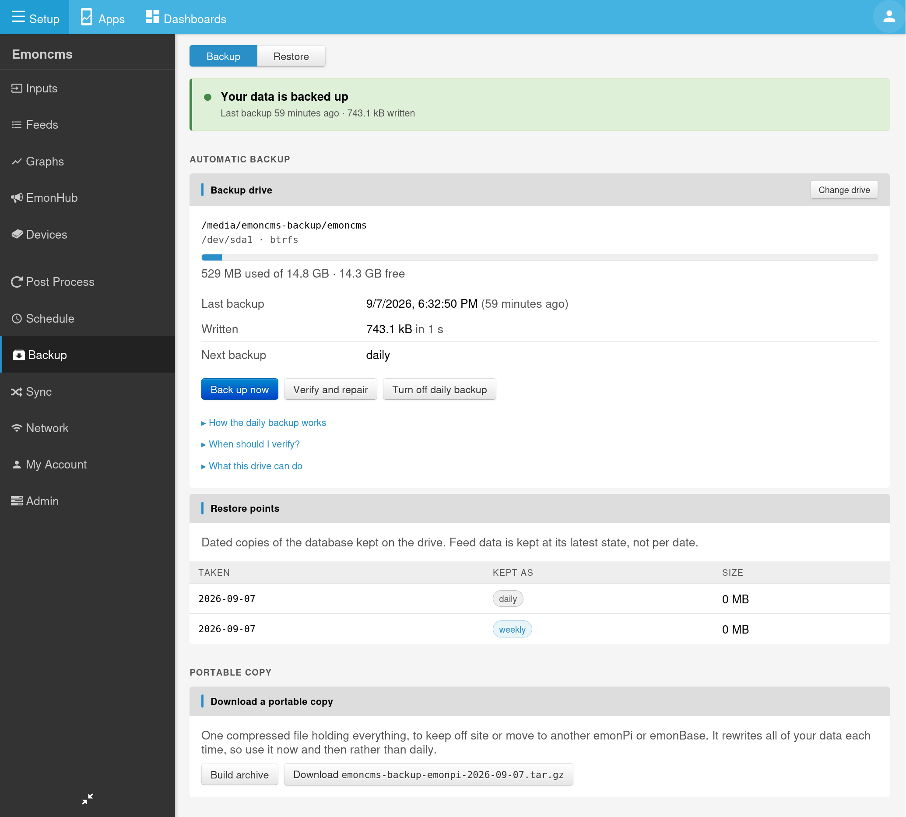

# Emoncms backup

Backup and restore for Emoncms. There are two kinds of backup.

- **A portable archive.** One `.tar.gz` file holding the MYSQL database, the phpfina, phpfiwa and phptimeseries feed data, `emonhub.conf` and `settings.ini` (or `settings.php`). `emoncms-export.sh` builds it and `emoncms-import.sh` reads it. Use it to move to another system or to keep a copy off site.
- **A daily backup to an attached drive.** A mirror on a USB drive or NAS share that writes only what has changed. `drive-backup.sh` maintains it and `drive-restore.sh` restores from it.

Both are available from the **Backup** module in Emoncms and from a shell.

## User guide

[Backup module User Guide](https://guide.openenergymonitor.org/setup/import/) and a [video screencast](https://www.youtube.com/watch?v=5U_tOlsWjXM).

## Install

Requirements:

- Emoncms master or stable, installed in `/var/www/emoncms`
- Redis enabled
- The service-runner service running ([install instructions](https://github.com/emoncms/emoncms/blob/master/scripts/services/install-service-runner-update.md))

Install the EmonScripts repository if it is not already present:

    cd /opt/openenergymonitor
    git clone https://github.com/openenergymonitor/EmonScripts.git

Install this module:

    cd /opt/emoncms/modules
    git clone https://github.com/emoncms/backup.git
    cd backup
    ./install.sh

`install.sh` creates `config.cfg` from `default.config.cfg`, symlinks the module into Emoncms, raises the PHP upload limits and creates the uploads folder. On a Raspberry Pi it also installs the packages and systemd timers for the drive backup, see [Enabling it](#enabling-it).

## Portable archive

Export from a shell:

    ./emoncms-export.sh

The export stops `feedwriter` while it runs and writes the whole dataset each time.

The browser upload can fail for a large archive. In that case:

1. Copy the `.tar.gz` file to the `backup_source_path` directory named in `config.cfg`
2. Run `./emoncms-import.sh`

## Backup to an attached drive

`emoncms-export.sh` rebuilds and recompresses a complete archive on every run, writing about twice the size of the dataset. That is too slow for a daily backup and wears out a flash drive.

`drive-backup.sh` keeps a directory mirror on the drive and writes only what has changed. The destination can be a USB disk or a NAS share. PHPFina and PHPTimeSeries are append only stores with fixed record sizes (4 and 9 bytes), so from one day to the next the only new feed data is at the end of each file. `rsync --append-verify` writes just that tail.

Measured on a system with 83 feeds and 738 MB of PHPFina data:

| | written per run |
|---|---|
| `emoncms-export.sh` (tar + gzip) | ~1.5 GB |
| `drive-backup.sh` feed data | 1.8 MB |
| `drive-backup.sh` MYSQL dump | 1.1 MB |

The MYSQL dump uses `--single-transaction`, so `feedwriter` keeps running.

### Enabling it

Backing up to a drive runs as root. It reads every feed file, mounts drives, writes `/etc/fstab` and can format a disk. It is behind a switch in `config.cfg`:

    drive_backup_enabled="yes"

`install.sh` sets it to `yes` on a Raspberry Pi and to `no` anywhere else. To use it on a virtual machine or a server, set it to `yes` by hand and run `install.sh` again. That installs the timers and the `rsync`, `parted` and `btrfs-progs` packages.

With the switch at `no`, `drive-backup.sh` and `drive-restore.sh` refuse everything except listing drives and turning the timers off. This applies from the interface and from a shell alike. The interface says how to turn it on.

The scripts check the switch themselves. `config.cfg` cannot be written from the web interface, so a compromised web tier cannot flip it, and the `backup-drive-*` entries in the `service-runner` whitelist do nothing on a system where the feature is off.

### Setting up a drive

The quickest route is the **Backup** tab. Plug the drive in and press **Scan for drives**. The tab lists drives that are already mounted alongside drives that are plugged in and not yet mounted, and offers each whatever it needs next.

Confirming a drive mounts it, adds it to `/etc/fstab`, selects it as the backup destination and prepares it. Any drive can instead be erased and formatted as btrfs, behind a typed confirmation that lists everything currently on the disk. A drive with no filesystem is offered that way only.

btrfs is the recommended format. It checksums every block, so damage on the drive is detected. Mounted with `compress=zstd` it compresses feed data by about 80%, and it can snapshot the feed data as well as the database.

Only drives that are not on a disk the running system uses are offered, so the SD card cannot be picked by mistake. See [What the interface does](#what-the-interface-does) below.

To do it by hand:

**1. Mount the drive.**

For a USB disk use `noatime` and `nofail`. `noatime` avoids a metadata write per file on each run. `nofail` lets the system boot when the drive is missing.

    UUID=xxxx  /media/backup  ext4  defaults,noatime,nofail,x-systemd.device-timeout=10  0  2

For a NAS, mount the share. On NFS use `soft`, so an unreachable server returns an error instead of blocking, and `nofail`.

    nas:/volume/emoncms  /media/backup  nfs   defaults,soft,timeo=50,retrans=2,nofail,noatime  0  0
    //nas/emoncms        /media/backup  cifs  credentials=/etc/emoncms-nas.cred,nofail,noatime,uid=root,gid=root  0  0

**2. Choose it as the backup destination.**

From the **Backup** tab, or from a shell:

    ./drive-backup.sh --discover              # list what is available
    ./drive-backup.sh --set-path /media/backup

Or set it in `config.cfg` and prepare it yourself:

    drive_backup_path="/media/backup/emoncms"
    ./drive-backup.sh --init

### Usage

    ./drive-backup.sh              # append new data only, for daily use
    ./drive-backup.sh --verify     # full checksum check and repair
    ./drive-backup.sh --dry-run    # report what would be written, write nothing
    ./drive-backup.sh --if-mounted # skip quietly if the drive is unavailable
    ./drive-backup.sh --discover   # list mounted drives that could hold a backup
    ./drive-backup.sh --set-path <mountpoint>   # select one and prepare it

    ./drive-backup.sh --discover-devices        # list drives that are not mounted
    ./drive-backup.sh --mount <id>              # mount one, add it to fstab, use it
    ./drive-backup.sh --format-mount <id> --confirm-erase   # ERASES the whole disk, formats btrfs

    ./drive-backup.sh --enable-schedule    # turn the daily and weekly timers on
    ./drive-backup.sh --disable-schedule   # and off again

`<id>` is the first column of `--discover-devices`, normally a `/dev/disk/by-id/` path. Kernel names such as `/dev/sda` are handed out in the order drives appear, so the drive scanned as `/dev/sda` can be a different drive by the time the user confirms.

The first run copies the whole dataset. Later runs append new data only.

Run `--verify` weekly or monthly. `--append-verify` skips any file whose size on the destination matches the source, so a same size rewrite in place (PHPFina back filling padding, or the postprocess module rewriting history) is invisible to the default mode. Verify compares every file by checksum and rewrites only the blocks that differ.

### Scheduling

`install.sh` installs two systemd timers when the drive backup is enabled. Choosing a destination, in the interface or with `--set-path`, turns them on. They can also be turned on and off from the **Backup drive** card in the interface, or from a shell:

    ./drive-backup.sh --enable-schedule
    ./drive-backup.sh --disable-schedule

which is equivalent to:

    sudo systemctl enable --now emoncms-drive-backup.timer emoncms-drive-backup-verify.timer

| Timer | Schedule | Runs |
|---|---|---|
| `emoncms-drive-backup.timer` | daily | append new feed data |
| `emoncms-drive-backup-verify.timer` | Sundays 04:00 | full checksum verify and repair |

Both use `Persistent=true`, so a backup missed while the system was off runs at the next boot, and `RandomizedDelaySec=1h`, so several systems on one site do not wake together.

The timers run the script with `--if-mounted`. An absent drive, an unreachable share or a run already in progress counts as a skipped run, not a failure. The next run after the drive returns catches up.

Check status:

    systemctl list-timers 'emoncms-drive-backup*'
    systemctl status emoncms-drive-backup
    journalctl -u emoncms-drive-backup -o cat

Each run also writes `/var/log/emoncms/drivebackup.log` (`drivebackup-verify.log` for verify), overwritten each time.

Run one now:

    sudo systemctl start emoncms-drive-backup

### The Emoncms interface

The module has two tabs, **Backup** and **Restore**.

Backup opens with one line saying whether the data is protected.

| Colour | Meaning |
|---|---|
| green | a recent backup exists and the daily timer is on |
| amber | the drive is disconnected, no backup has been taken yet, the last backup is more than two days old, or the timer is off |
| red | the last run failed, the last backup is more than a week old, or the drive is mounted but not answering |

Below that the tab has two sections.

**Automatic backup.** The **Backup drive** card shows where the copy goes, how full the drive is, when it last ran and what it wrote, and when it runs next. Its buttons back up, verify, and turn the daily schedule on and off. Explanations sit inside the card as disclosures. **Change drive** opens the list of drives. A second card, **Restore points**, lists the database snapshots held on the drive.

When there is no working destination, or **Change drive** is pressed, one card lists every drive that could be used. Mounted drives sit alongside drives that still need setting up. **Scan for drives** looks again.

**Portable copy.** Build an archive and download it.

Each run reports Complete, Failed or Nothing to do in the header of its log.

Restore gathers the three recovery paths: the backup drive, an uploaded `.tar.gz` archive, and an old emonSD card in a USB reader. Restoring from the drive or the SD card needs a confirmation box ticked.

#### What the interface does

**Scan for drives** runs `--discover-devices`. A device is offered if it is not on a disk carrying a mounted filesystem or active swap, is not read only, is at least 512 MB, and holds either a mountable filesystem or nothing at all. Swap, LVM and RAID members and encrypted volumes are never listed. A card reader with no card in it is listed as such and cannot be used.

Confirming a drive runs `--mount <id>`, which:

1. checks the identifier against its own `--discover-devices` output, as `--set-path` checks a mountpoint. The interface cannot name a device of its own choosing.
2. picks the name for `/etc/fstab`: the filesystem UUID, else its `PARTUUID`, else the `/dev/disk/by-id/` path it was chosen by. FAT has only a short volume serial and some drives report none. If that name is already in `/etc/fstab`, the mountpoint in that entry is used.
3. otherwise picks the first free of `/media/emoncms-backup`, `-2`, `-3` and so on, and adds an entry with `noatime,nofail,x-systemd.device-timeout=10`. btrfs also gets `compress=zstd`. FAT, exFAT and NTFS get `uid=root,gid=root,umask=0022`, since they cannot store unix ownership.
4. copies `/etc/fstab` to `/etc/fstab.emoncms-backup.<timestamp>.bak` first, and restores it if the drive fails to mount.
5. hands over to `--set-path`.

`--format-mount <id> --confirm-erase` first erases the **whole disk** the device sits on and writes a GPT label, one partition and a btrfs filesystem labelled `emoncms-backup`. The whole disk, because a used SD card carries a boot partition and a root partition and formatting one of them leaves a mixed card. `--discover-devices` reports the disk and its contents in its last three columns and the interface shows them in the confirmation. Before writing, the script checks again that nothing on the disk is mounted or in use as swap. `/etc/fstab` entries naming the old filesystems are removed, with the same backup. The interface asks for `ERASE` to be typed and sends it with the request. The module checks it before queueing anything.

Formatting needs `parted` and `btrfs-progs`, which `install.sh` installs.

#### Running as root

Everything past the read only queries needs root. The systemd timers run the script as root. From the Emoncms interface it runs as the `service-runner` user and re-execs itself under `sudo -n`. Without passwordless sudo it stops with a message.

`--discover` and `--discover-devices` run before that point, directly as the web server user, which has no sudo rights and needs none. So does the `drive_backup_enabled` check.

This relies on the `service-runner` user having passwordless sudo for everything. The Raspberry Pi OS default user has it and the EmonScripts install guides set it up elsewhere. A sudoers rule naming just these two scripts would be no tighter, since the same user owns them and could edit them. Tightening it means making the scripts root owned and read only to that user, then granting sudo for exactly those paths.

Every drive action that changes something must be requested with POST. The session cookie is `SameSite=Strict`, so another site cannot make the browser send it, and a link or an image tag cannot start an action.

The destination chosen in the interface is written to `drive-backup-path.conf`, which takes precedence over `config.cfg`. `config.cfg` is sourced as shell by scripts running as root, so it is not writable from the web interface. The interface can only select a mountpoint that `--discover` reported, and `--set-path` checks the mountpoint against that list again.

The tab needs `service-runner` running with `backup-drive-sync`, `backup-drive-verify`, `backup-drive-setpath`, `backup-drive-mount`, `backup-drive-schedule` and `backup-drive-restore` on its whitelist. They are in Emoncms core from the `backup_support` branch onwards. `service-runner` reads the whitelist at startup, so restart it after updating Emoncms. An action missing from the whitelist is rejected without output. The interface reports an action as not started when the log has not changed 15 seconds after the request.

### Layout on the drive

    /media/backup/emoncms/
        .emoncms-backup-target      marker, the script refuses to write without it
        phpfina/  phpfiwa/  phptimeseries/
        config/                     settings.ini (or settings.php), emonhub.conf
        sql/daily/                  last 7 MYSQL dumps
        sql/weekly/                 last 4, hard linked so they cost no extra space
        status.json                 result of the last run

### Restoring

`emoncms-import.sh` reads a `.tar.gz` archive and cannot read this mirror. Restoring uses `drive-restore.sh`:

    ./drive-restore.sh --list        # show the snapshots on the drive
    ./drive-restore.sh               # restore the newest, asks you to confirm
    ./drive-restore.sh --sql <name>  # restore a specific snapshot
    ./drive-restore.sh --dry-run     # report what would be done, change nothing
    ./drive-restore.sh --delete      # also remove feed files not in the backup

It stops the Emoncms services, imports the chosen MYSQL snapshot, copies the feed data back, restores `emonhub.conf`, flushes redis and restarts everything.

Before overwriting anything it dumps the current database to `backup_location` as `pre-restore-<date>.sql.gz`. A restore started by mistake can be undone with:

    gunzip -c <backup_location>/pre-restore-<date>.sql.gz | mysql -u<user> -p <database>

Feed data is overwritten in place and is not covered by that safety net.

`settings.ini` and `settings.php` are held in the backup for reference and are **not** restored. They hold the database credentials and paths of the system the backup was taken from.

Feed files present on this system but absent from the backup are left alone by default. Pass `--delete` to make this system an exact mirror of the backup.

The restore refuses to run without `--yes` when it is not attached to a terminal, so a cron job or a stray script cannot destroy data. The Emoncms interface passes `--yes` after its own confirmation.

The lock file is shared with `drive-backup.sh`, so a backup and a restore never run at the same time.

### Backing up to a NAS

Everything above works with an NFS or SMB share as the destination. Four things differ from a local disk.

**Ownership.** `rsync -a` preserves unix ownership and permissions. A CIFS share mounted with a fixed `uid`, `gid` or `file_mode`, and any FAT, exFAT or NTFS filesystem, cannot store them, and rsync then reports a failure for every file. `drive_backup_preserve_permissions="auto"` (the default) detects those filesystems and syncs without ownership. Nothing is lost. `drive-restore.sh` sets ownership on the way back in regardless. Set it to `yes` or `no` to force the behaviour.

**Reachability.** A share can be mounted and unreachable. On a hard NFS mount any access then blocks in uninterruptible IO indefinitely and the systemd unit hangs. Both scripts probe a network destination first and give up after `drive_backup_probe_seconds` (default 20). Under the timer this counts as a skipped run, like an unplugged USB drive. Mount NFS shares with `soft` as well, so that reads during the run fail instead of hanging.

**Compression and restore points come from the filesystem.** Compressing a feed file, or hard linking it into a dated snapshot directory, means rewriting the whole file on every run, which is the cost this design avoids. A copy on write filesystem gives both for free. Compression happens per extent below the append and a snapshot costs only the delta. Format the backup drive as btrfs and mount it with `compress=zstd`. Measured on real PHPFina data, feed files compress by about 80%. This is what the interface's erase and format action does. The interface reports which of these the chosen drive supports.

**Verify cost.** Verify reads every byte on both sides. Over gigabit ethernet a 3 GB dataset is about half a minute of transfer. Over wifi or 100 Mbit it is minutes. For a network destination consider running it monthly:

    sudo systemctl edit emoncms-drive-backup-verify.timer

    [Timer]
    OnCalendar=
    OnCalendar=monthly

The daily append run transfers only the new readings, a few megabytes.

### A drive that was unplugged and plugged back in

Unplugging a USB drive and plugging it back in does not restore the mount. The drive comes back as a new device and the old mount is left behind. It is still listed by `findmnt` and still answers reads from the kernel's caches, and every write fails with `Input/output error`.

The marker file check can be satisfied from cache, so before writing anything the script writes a few bytes to the destination, forces them to the device with `sync -f`, reads them back and removes them. If that fails it stops and prints the two commands that fix it:

    sudo umount -l /media/emoncms-backup
    sudo mount /media/emoncms-backup

This is reported as a failed run, even under `--if-mounted`. A drive that is plugged in and not working would never back up again, and nobody would be told.

The interface reports this state separately from a disconnected drive, since reconnecting the drive is the wrong advice here.

### Safety

The script refuses to run if the destination is missing its marker file or is on the root filesystem, which is what happens when the USB drive is not mounted. Both checks stop an unmounted drive filling the system disk with a copy of the feed data. Set `drive_backup_allow_same_filesystem="yes"` to override the second check when deliberately backing up to the same disk.

A feed removed from Emoncms is left in place on the backup and reported as an orphan.
